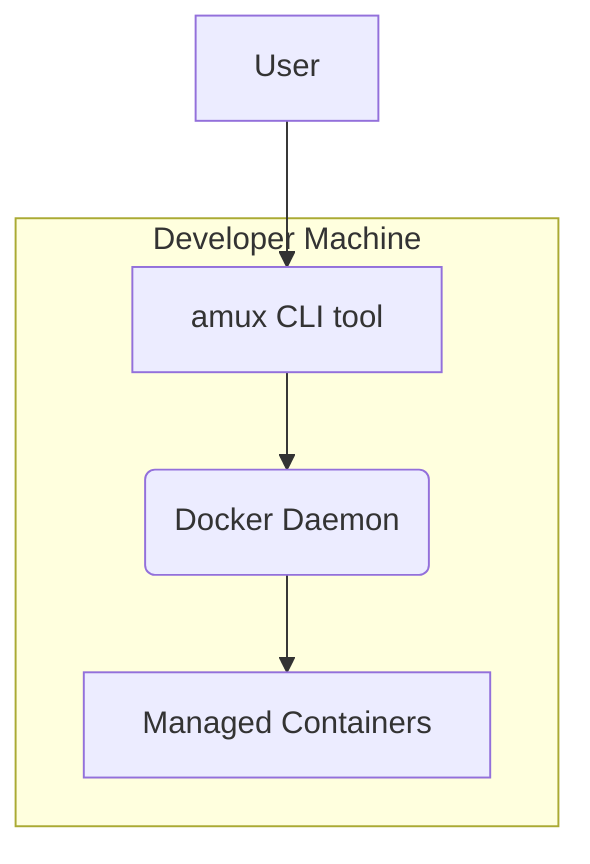

# Project Architecture

Pattern: single statically-linked binary

## Design Principles

### Principle 1
Description:
- simplicity over conciseness
Reasoning:
- intermediate developers should feel at home in this codebase

### Principle 2
Description:
- layered testing
Reasoning:
- by combining layers of unit tests, integration tests, and end-to-end tests, maximal test coverage can be achieved

## High-level Architecture:

## Major Components

### Component 1:
Name: amux CLI
Purpose: allow user to interact efficiently with their project's aspec folder, and securely execute agentic coding tools within containers
Description and Scope:
- description: a CLI tool which allows for "command" execution (one-offs) or "interactive" mode (acting as a REPL)
- scope: a single CLI binary which interacts with files in the current active Git repo ONLY and the locally installed Docker Daemon