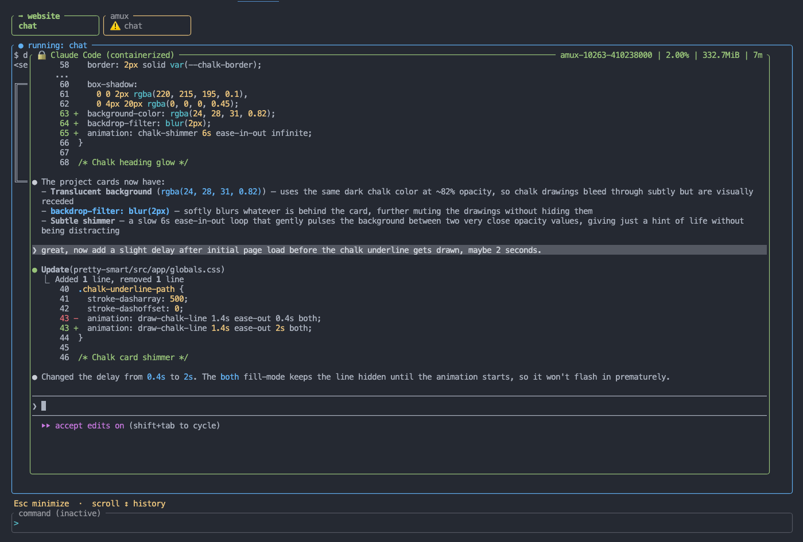

# amux 0.2: Multiplayer code and claw agents in your terminal

*March 24, 2026*

---

As I started working more with code agents and they became entwined in my workflows, I started getting itchy. The itchiness came from running an agent and sitting there while it worked. It felt like a waste, since my brain had already planned out the next 3 tasks I wanted to get moving on. The shift from single-agent to "multiplayer" felt necessary to me, since I started concocting mental work plans that would normally take weeks, but with the help of code agents could be accomplished in a single day, given the right workflow. 

I built `amux` (formerly `aspec-cli`) because I needed that itch to go away. It's now regularly running 5-7 code agents and nanoclaw on my homelab Mac Mini for me. I know, it's basically a meme to have a mac mini running AI agents at this point, but if you have a goal you're working towards and you can get to that goal 5-10x faster because you have a team of agents working on it for you... that's addicting as hell. 

## tmux for Agents

amux was built on the idea that the right abstraction for agentic development is a contract between you and your agents — structured specs for context, containers for safety. v0.1 gave you that for a single session at a time. v0.2 makes it multiplayer.

The TUI now has a full tab system. Each tab is an independent agent workspace: its own working directory, its own container session, its own scrollback. Open a tab for your current feature, open another for a bug fix, open another to chat about architecture. All of them running simultaneously, switching between them with a keystroke. The tab bar shows each session's live state at a glance — idle, running, active agent container, claw session, or stuck.

That last state matters: if an agent goes silent for 60+ seconds, the tab turns yellow and flags it. Agents get stuck. Now you'll know.

This is the core of what multiplayer means in practice: you're not babysitting a single agent anymore. You're managing a team.

## Nanoclaw: A Persistent Background Agent

The tab system gives you multiplayer within a session. Nanoclaw gives you multiplayer across time.

Nanoclaw is a persistent, machine-global claw agent running in a background Docker container. It doesn't belong to a project — it belongs to your machine. Unlike `chat` and `implement` sessions that spin up, do work, and exit, nanoclaw runs continuously and survives reboots. You can reach it through Slack, Discord, or any messaging integration you wire up. Ask it to start a task before bed and review the results in the morning.

The important technical detail: nanoclaw has Docker socket access. This means it can spin up containers, run builds, and orchestrate multi-step workflows that themselves require containerized execution. It's not just a persistent chat window — it's an agent that can do agent-level work autonomously, without a human in the loop.

Setup is guided: `amux claws ready` walks you through forking nanoclaw, building the image, and getting the container running. After that, it's always there.

With tabs running parallel project sessions and nanoclaw handling async background work, you have a genuine multi-agent setup for the first time.

## What This Changes

The 0.1 workflow was: write a spec, run an agent, wait, review. Linear and deliberate. Good for careful feature work.

The 0.2 workflow is: spec several work items, fan them out across tabs, kick a longer task to nanoclaw, and review everything when it's ready. You're orchestrating rather than supervising.

The security model doesn't change — every session is still containerized, isolated, and transparent. The specs still give agents the context they need to make good decisions. Multiplayer just means you can apply that model to more work simultaneously.

## Getting Started with 0.2

If you're already on amux, the tab system is available immediately — open the TUI and press **Ctrl+T** to open your first new tab. See [`docs/usage.md`](../usage.md) for the full keyboard reference.

For nanoclaw, run `amux claws ready` to start the setup wizard. You'll need a GitHub account and Docker running. The nanoclaw source is a fork you control — amux just manages the container lifecycle. See the [cli spec](../../aspec/uxui/cli.md) and [`docs/usage.md`](../usage.md) for details.

New to amux entirely: [`docs/getting-started.md`](../getting-started.md) covers initialization, the spec workflow, and your first agent session.

---

The project is at [github.com/prettysmartdev/amux](https://github.com/prettysmartdev/amux). Issues and contributions are welcome.
